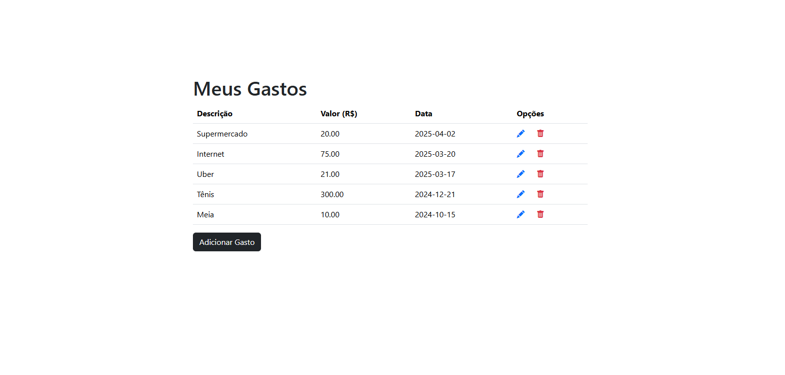
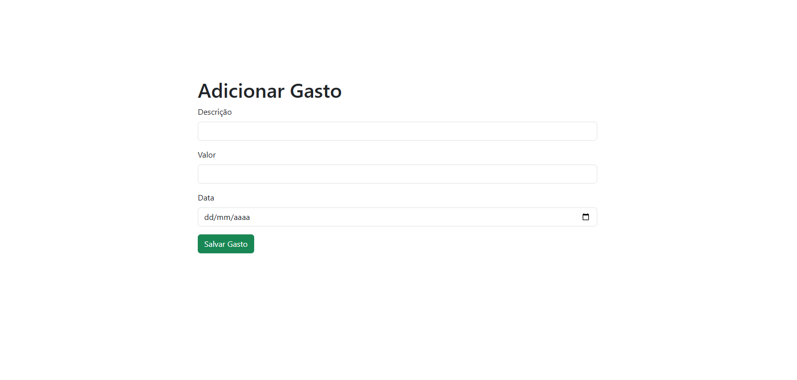
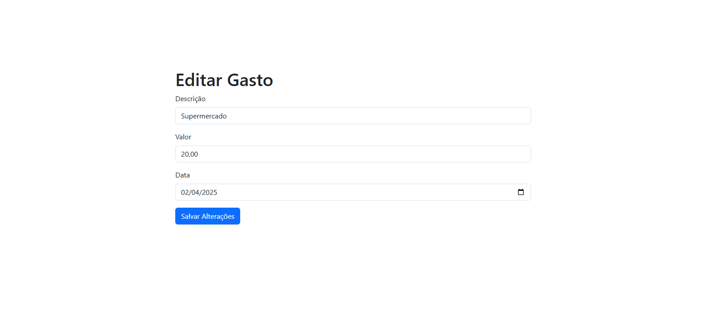

## CRUD Controle de Gastos

Um aplicativo web para gerenciamento de despesas pessoais, desenvolvido com Flask e SQLAlchemy.

#### Funcionalidades Principais

- **Visualização organizada**: Lista todos os gastos em tabela ordenada por data (mais recente primeiro)

- **Adicionar gastos**: Registre novas despesas com descrição, valor e data

- **Edição flexível**: Atualize qualquer informação dos gastos cadastrados

- **Exclusão segura**: Sistema de deleção lógica

#### Tecnologias Utilizadas

- **Backend**:
  - Python 3
  - Flask 3.0.0
  - Flask-SQLAlchemy 3.1.1
  - SQLAlchemy 2.0.25

- **Frontend**:
  - Bootstrap 5.3.5
  - Ícones Bootstrap Icons

#### Instalação 

1. **Clone o repositório**:
   ```bash
   git clone https://github.com/renan-git/crud-controle-de-gastos.git
   cd crud-controle-de-gastos
   ```

2. **Configure o ambiente virtual**:
   ```bash
   python -m venv venv
   # Ativação:
   # Windows: venv\Scripts\activate
   # Linux/Mac: source venv/bin/activate
   ```

3. **Instale as dependências**:
   ```bash
   pip install -r requirements.txt
   ```

4. **Configure as variáveis de ambiente**:
   ```bash
   set FLASK_APP=main.py  # Windows
   # ou
   export FLASK_APP=main.py  # Linux/Mac
   ```

5. **Execute a aplicação**:
   ```bash
   flask run
   ```

6. **Acesse no navegador**:
   ```
   http://localhost:5000
   ```

7. **Crie um arquivo `.env` na raiz do projeto com:**
```
sqlite=sqlite:///expenses.db
```